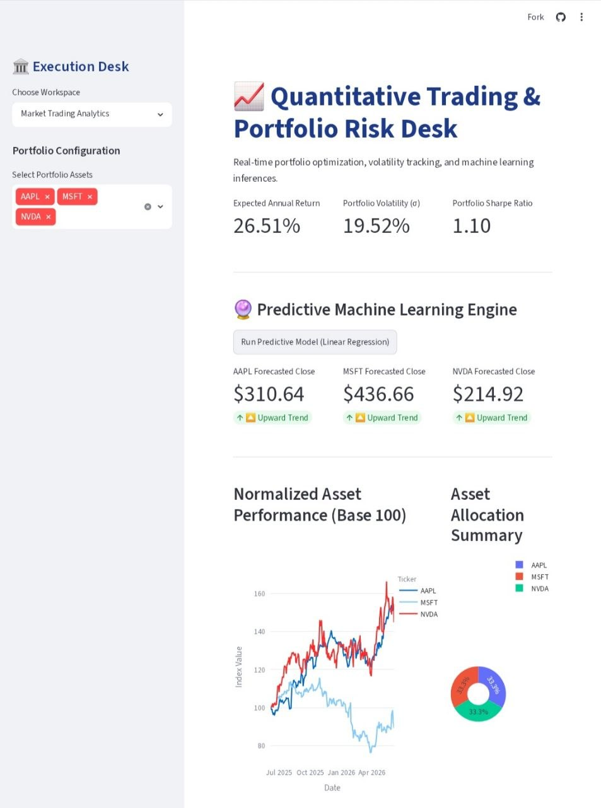
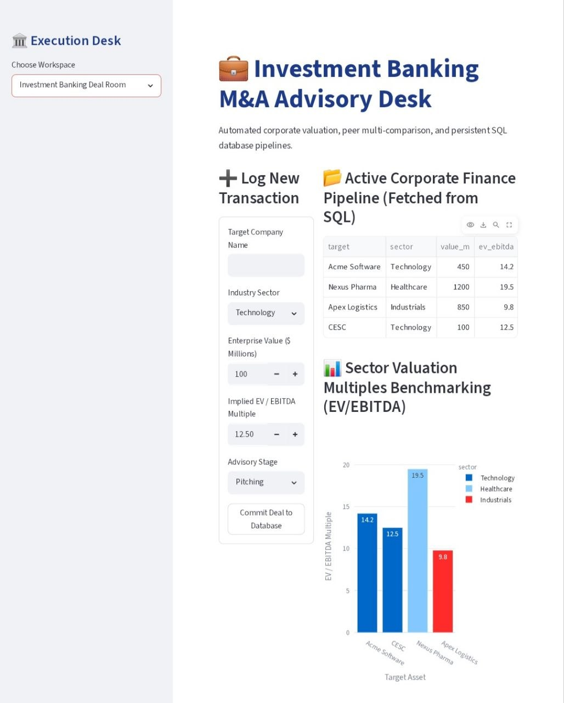

# Institutional Trading Analytics & Investment Banking Deal Desk
🚀 **Live Application Link:** https://sabarni-investment-banking-dashboard.streamlit.app

An automated, end-to-end Python web application designed to bridge quantitative market analytics with corporate finance advisory workflows. This portal provides real-time portfolio optimization, risk forecasting using predictive Machine Learning models, and a persistent transactional database pipeline for tracking Investment Banking M&A deal desks.

---

## 📌 Project Overview & Architecture

This application functions as a dual-workspace environment built entirely in Python using **Streamlit**. It optimizes complex financial calculations on the fly while offering an enterprise-grade interactive interface.


### Core Architectural Pillars:
1. **Market Trading Desk:** Ingests live financial time-series metrics via the Yahoo Finance API, auto-refreshes every 30 minutes, and uses mathematical frameworks to evaluate risk-adjusted performance.
2. **Predictive Analytics Engine:** Integrates machine learning architectures to forecast asset volatility and upcoming close trends.
3. **M&A Advisory Workspace:** Implements a localized relational database schema to record, track, and benchmark corporate transactions securely without session data loss.

---

## 🛠️ Tech Stack & Financial Frameworks

* **Dashboard Core:** Streamlit (Python Web Application Framework)
* **Data Automation & Ingestion:** `yfinance` API, `pandas`, `numpy`
* **Data Visualization:** Plotly Express & Plotly Graph Objects (Dynamic UI Rendering)
* **Machine Learning Stack:** `scikit-learn` (Linear Regression Engine)
* **Database & Persistence Layers:** SQLite (`sqlite3` Relational Mapping)

### Financial Math Core
* **Portfolio Return ($R_p$):** Weighted annualized individual security closing distributions.
* **Portfolio Risk ($\sigma_p$):** Covariance matrix optimization mapped across asset allocations.
* **Risk-Adjusted Efficiency:** Built-in calculation of the **Sharpe Ratio** to evaluate yield against market volatility benchmarks:

$$Sharpe\ Ratio = \frac{R_p - R_f}{\sigma_p}$$

---

## 🚀 Key Features

### 1. Quantitative Risk Desk
* Multi-asset selection capability with responsive portfolio tracking.
* High-performance KPI cards updating Expected Annual Returns, Portfolio Volatility, and Sharpe Ratios.

* Interactive time-series performance charts tracking base-100 normalized performance asset indices.
* **ML Price Forecast Engine:** Runs a rolling 5-day and 20-day Moving Average (MA) inference model on the fly to flag technical directional metrics (Upward/Downward Trends) for the upcoming market session.

### 2. Investment Banking Advisory Desk
* Interactive M&A workflow pipeline entry forms capturing Target Name, Industry Sector, Enterprise Value ($M), and Implied Multiples.
* **Persistent SQL Storage:** Uses structural SQL schemas to save logged transactions directly into an internal database file, preserving corporate records across user sessions.

* **Valuation Multiples Benchmarking:** Real-time data visualization plotting competitor valuation comps side-by-side using dynamic **EV/EBITDA** multiple analytics.

---

## 💻 Local Installation & Setup

To replicate this environment locally, open your Anaconda Prompt or terminal and run the following commands:

```bash
# 1. Clone the repository
git clone [https://github.com/YOUR_USERNAME/investment-banking-dashboard.git](https://github.com/YOUR_USERNAME/investment-banking-dashboard.git)
cd investment-banking-dashboard

# 2. Set up and activate your virtual environment
conda create --name market_trading python=3.11 -y
conda activate market_trading

# 3. Install core dependencies
python -m pip install -r requirements.txt

# 4. Launch the application
python -m streamlit run app.py
